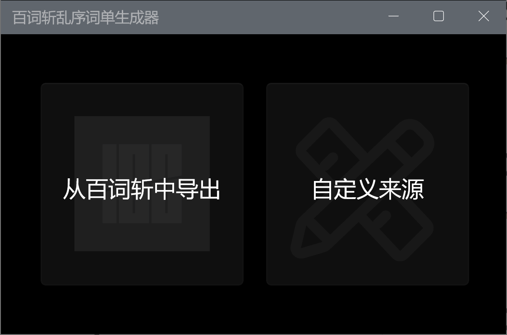
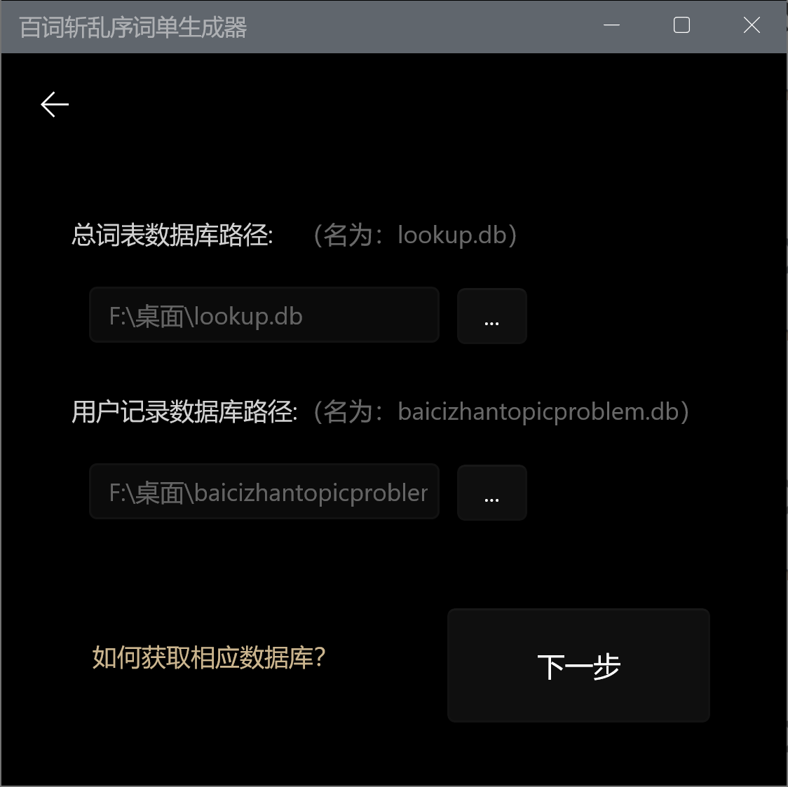
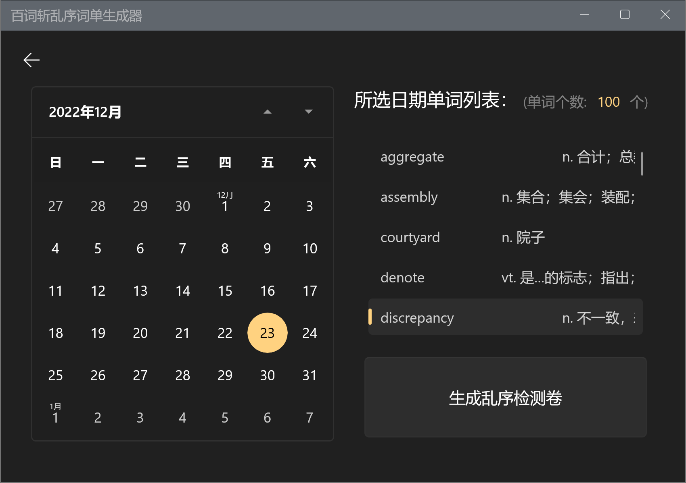

# Disorder
> 将百词斩中每日背过单词导出，生成乱序拼写检测卷！


#### 注： 本工具通过百词斩的用户数据库获取单词，~~而非使用爬虫和后端接口~~，因此需要使用者手动获取lookup.db,和baicizhantopicproblem.db数据库
[如何获得相应数据库]()

# Features
- 自动查询相应数据库,可做到可视化分别查询不同词书的已背单词
- 实现查询通过日历指定的日期所背单词, 支持选择多个日期,将不同时期所背单词累加, 一并生成乱序,便于检测一段时间背单词成果
- **还在担心电子设备背单词容易遗忘? 嫌弃传统抄写单词过于繁琐麻烦? 本工具结合市面上最强大的手机端图背单词软件与纸质学习各自的优势,将符合记忆曲线的学习内容打乱顺序,检测学习成果!**

### 所使用的SQL语句示例
> 查询当日新学单词
```sql
select word,mean_cn,create_at from ts_learn_offline_dotopic_sync_ids_559 as t,
(select * from main.dict_a_b
union select * from main.dict_c
union select * from main.dict_d_f
union select * from main.dict_g_k
union select * from main.dict_l_o
union select * from main.dict_p_r
union select * from main.dict_s
union select * from main.dict_t_z) A
where t.topic_id=A.topic_id and is_today_new=1;
```
### 乱序算法
```csharp
private static List<List<string>> GetDisruptedItems(List<List<string>> source)
{
    List<List<string>> temp = new List<List<string>>();
    for (int i = 0; i < source.Count; i++)
    {
        temp.Add(source[i]);
    }
    Random rand = new Random(DateTime.Now.Millisecond);
    for (int i = 0; i < temp.Count; i++)
    {
        for (int j = i + 1; j < temp.Count; j++)
        {
            if (rand.Next(2) == 1)
            {
                List<string> t = temp[i];
                temp[i] = temp[j];
                temp[j] = t;
            }
        }
    }
    return temp;
}
```




